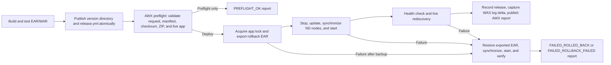

# Existing WebSphere application release pipeline

<!-- This runbook is packaged with the waslab.wasnd collection. -->

This is the supported operator and CI pipeline for updating an application that
is already installed in traditional WebSphere Base or Network Deployment. The
runtime change is performed by AWX and the `waslab.wasnd` collection. It does
not require an application catalog and it never performs a new installation.

## Operator quick start

1. Open the environment-specific AWX template named
   **WAS - Update Existing Application**.
2. Select **Launch** and enter only:
   - **Application name**: exact installed WebSphere application name.
   - **Release version**: immutable release-share directory name.
   - **Change ticket**: request, incident, or change identifier.
   - **Preflight only**: `true` validates without changing the application;
     `false` performs the guarded update.
3. Follow the numbered `[1/8]` through `[8/8]` tasks in the AWX output.
4. Read **AWX REPORT | Display the complete deployment report** and the
   deployment-time WAS log excerpt near the end of the job.
5. Use the final status and recovery table below. A rollback job is deliberately
   red even when recovery succeeds, so the rejected release cannot be mistaken
   for a successful deployment.

No operator enters a cluster, node, context root, virtual host, checksum, log
path, WebSphere credential, or health URL. Existing application identity and
bindings come from live WAS; checksum and health policy come from the immutable
release manifest; credentials and environment routing belong to the AWX
template and inventory.

## Pipeline overview



## Release-producer pipeline

The build system owns artifact production. AWX consumes an immutable directory;
it does not compile applications or accept uploads from the survey.

### 1. Build

- Compile and package the complete EAR or WAR.
- Preserve existing module identity for an update. Changing module URIs,
  display names, targets, or bindings is a topology change and belongs in the
  advanced/new-install process.
- Run unit, integration, security, and archive-integrity checks appropriate to
  the application.

### 2. Create the manifest

For application `orders` version `2026.08.09.3`, publish:

```text
/mnt/was-releases/orders/2026.08.09.3/
|-- orders.ear
`-- release.yml
```

Minimum `release.yml` contract:

```yaml
schema_version: 1
application: orders
version: 2026.08.09.3
filename: orders.ear
sha256: 9be4f4cda47b1f36f5af9be84b5bfbf4e9930ac9f399429d77d11ec6e27f3210
source_commit: 81e0b260a6b87bb8b9470cfc8df80b7297b16d34
built_at: "2026-08-09T19:25:00Z"
built_by: application-ci
release_notes: Correct order total calculation
health:
  url: https://orders.internal.example/health
  status_code: 200
  contains: 2026.08.09.3
  retries: 20
  delay: 3
  validate_certs: true
```

The health check should prove the requested version, preferably with a version
header or response field. A generic home page returning HTTP 200 is not a
sufficient production readiness check.

### 3. Publish atomically

- Write to a temporary version directory on the release share.
- Calculate SHA-256 from the final archive bytes.
- Write `release.yml` only after the archive is complete.
- Rename/promote the directory into its final version path atomically.
- Make submitted versions read-only. Never overwrite an existing version.
- Mount the release root read-only on the WAS administrative host.

### 4. Launch AWX

Humans normally launch through the survey. A CI/CD system may call the same job
template with an AWX OAuth token:

```bash
curl --fail-with-body \
  --request POST \
  --header "Authorization: Bearer ${AWX_TOKEN}" \
  --header "Content-Type: application/json" \
  --data '{
    "extra_vars": {
      "deployment_application": "orders",
      "deployment_version": "2026.08.09.3",
      "change_ticket": "CHG0123456",
      "preflight_only": "false"
    }
  }' \
  "${AWX_URL}/api/v2/job_templates/${AWX_TEMPLATE_ID}/launch/"
```

Store the token in the CI platform's protected secret store. Give it permission
to launch only the intended environment template; do not give it AWX
administrator access.

### 5. Wait for and retain the result

The launch response contains the job ID. Poll `/api/v2/jobs/<id>/` until the job
is terminal, then retain:

- AWX job ID and URL,
- final AWX status,
- `artifacts.was_deployment_report`,
- change ticket and immutable SHA-256,
- deployment-time WAS log artifact or excerpt, and
- approval identity when the production workflow includes approval.

## AWX execution stages

| Stage | AWX activity | Mutation allowed |
|---:|---|---:|
| 1/8 | Mark current SystemOut/SystemErr offsets | No |
| 2/8 | Ensure the administrative profile is available | Runtime only |
| 3/8 | Validate input, manifest, path, SHA-256, size, and ZIP structure | No |
| 4/8 | Discover the exact installed app, modules, mappings, bindings, and current release | No |
| 5/8 | Acquire the per-app lock, stage the archive, and export the installed EAR | Yes |
| 6/8 | Stop, update, synchronize configured ND nodes, and start | Yes |
| 7/8 | Verify health, rediscover runtime state, and record the successful release | Yes |
| 8/8 | Read only new WAS log lines and publish the complete AWX report | No |

Preflight-only stops after stage 4, then executes the reporting portion of
stage 8. Deployment repeats every validation rather than trusting an earlier
job or a mutable filename.

## What live discovery preserves

Before updating, `waslab.wasnd.application_info` reads the installed application
through genuine `wsadmin` and reports:

- application name and installed/running state,
- module URIs,
- module-to-server or module-to-cluster mappings,
- web-module context roots,
- virtual-host bindings, and
- runtime node/process instances.

The update uses `AdminApp.update` against that existing application rather than
calling the new-install path. A missing application is rejected before a lock,
stop, or archive update.

## Success and recovery statuses

| Report status | AWX job | Meaning | Operator action |
|---|---|---|---|
| `PREFLIGHT_OK` | Green | Request, release, and live application validated; nothing deployed | Review or launch the real deployment |
| `SUCCESS` | Green | New archive is running and health verification passed | Attach job/report to the ticket |
| `NO_CHANGE` | Green | Requested checksum is already the recorded successful release | No action; do not force redeploy |
| `FAILED` | Red | Failure occurred before rollback was armed, or recovery was not applicable | Correct the reported preflight/environment problem |
| `FAILED_ROLLED_BACK` | Red | New release failed; exported prior EAR was restored and answered health | Keep service on prior release, correct the artifact, submit a new version |
| `FAILED_ROLLBACK_FAILED` | Red | Both deployment and automatic recovery failed | Escalate immediately; preserve backup path and both errors |

Never relaunch the same version after changing its bytes. Correct the build and
publish a new immutable version.

## Logs and reports in AWX

The job output itself is the progress display. Search it for:

- `[1/8]` through `[8/8]` for stage progress,
- `PRECHECK COMPLETE` for live discovery results,
- `ROLLBACK |` for recovery actions,
- `AWX REPORT | Display the complete deployment report`, and
- `AWX REPORT | Display the deployment-time WAS log excerpt`.

`waslab.wasnd.log_delta` records byte offsets before deployment and returns only
new lines afterward. It detects truncation/rotation, caps output, and classifies
common WebSphere warning/error identifiers. The complete structured result is
published as the `was_deployment_report` AWX job artifact.

Production ND templates should collect logs from the application runtime nodes
identified by live discovery in addition to Dmgr deployment logs. Log content
must remain bounded and follow the organization's credential, PII, and
retention policy.

## Environment ownership

Create one AWX template per environment, such as development, test, staging,
and production. Bind inventory, credentials, administrative host, release share,
certificate policy, and RBAC to the template. Do not ask an application operator
to type those values.

The collection should auto-discover unambiguous WebSphere profile role,
application targets, synchronization nodes, and runtime log locations. When an
operating-system host contains multiple eligible installations or profiles, it
must fail with the candidates instead of guessing. The initial AWX inventory
host cannot be discovered by WAS because Ansible must select a host before it
can execute collection code.

## Production controls

- Attach the WebSphere password through an AWX credential; never survey it.
- Disable arbitrary extra variables and limit launch permission by environment.
- Require a native AWX approval node for production if change policy requires it.
- Allowlist health-check schemes, hosts, and ports.
- Serialize updates per application and reject active locks.
- Retain exported rollback EARs according to an explicit secure retention policy.
- Require HTTPS certificate validation for production health checks.
- Record requester, approver, job ID, ticket, version, and checksum.
- Test automatic rollback periodically with an approved failure-injection release.

## Boundary: new applications

This pipeline refuses an application that is not already installed. A new
installation requires intentional decisions that cannot be inferred safely:

- target cluster or servers,
- context roots and virtual hosts,
- shared libraries and class-loader policy,
- security-role and resource bindings,
- web-server routing, and
- initial operational ownership.

Use a separate approval-controlled onboarding workflow for those decisions.
